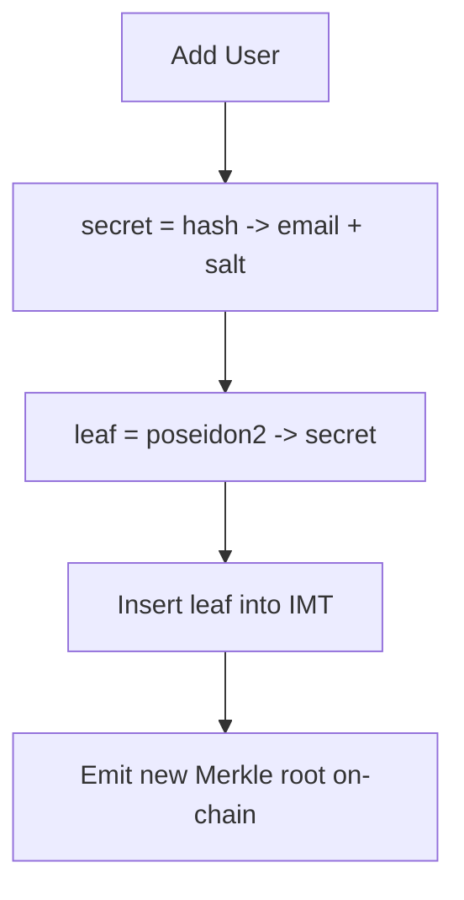
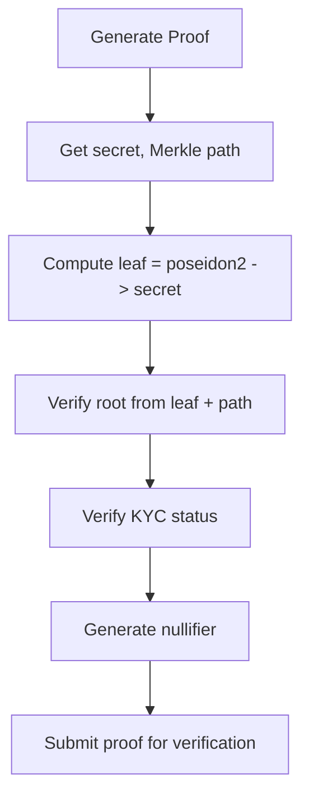

# B2B Membership Zero-Knowledge Proof System (IMT)

An alternative implementation of the B2B Membership ZKP system using **Incremental Merkle Trees** instead of polynomial commitments.

## 📊 Comparison: Polynomial vs IMT

| Aspect               | Polynomial                    | IMT                            |
| -------------------- | ----------------------------- | ------------------------------ |
| **Membership Proof** | Secret is root: P(secret) = 0 | Secret is leaf with valid path |
| **Commitment**       | Polynomial hash               | Merkle root                    |
| **Update Cost**      | O(n) - rebuild; n = 129       | O(log n) - path only           |
| **Proof Size**       | Constant (129 values)         | O(log n) path (20 values)      |
| **Max Members**      | 128 per batch                 | 2^20 ≈ 1M per tree             |

## 🏗️ Architecture

```
IMT/
├── circuit/
│   ├── src/main.nr      # Noir circuit
│   ├── Nargo.toml       # Circuit config
│   └── Prover.toml      # Test inputs
├── utils/
│   ├── merkle_tree.ts   # IMT implementation
│   └── test_data_generator.js
├── package.json
├── test_circuit.sh
└── README.md
```

## 🔒 How It Works

### Member Registration



### Proof Generation & Verification



## 🛠️ Installation

```bash
cd IMT
npm install
```

## 🚀 Usage

### 1. Generate Test Data

```bash
node utils/test_data_generator.js
```

### 2. Compile Circuit

```bash
cd circuit
nargo compile
```

### 3. Generate Proof

```bash
nargo prove
```

### 4. Verify Proof

```bash
nargo verify
```

### Full Test (requires bash)

```bash
./test_circuit.sh
```

## 🔧 Circuit Parameters

| Parameter      | Type        | Description           |
| -------------- | ----------- | --------------------- |
| `merkle_root`  | pub Field   | On-chain tree root    |
| `nullifier`    | pub Field   | Verification cache ID |
| `verifier_key` | pub Field   | Verification context  |
| `secret`       | Field       | Private member ID     |
| `isKYCed`      | bool        | KYC compliance        |
| `leaf_index`   | Field       | Position in tree      |
| `merkle_path`  | [Field; 20] | Sibling hashes        |
| `path_indices` | [Field; 20] | Path direction bits   |

## 📐 Tree Configuration

-   **Depth**: 20 (configurable in `main.nr`)
-   **Max Leaves**: 2^20 = 1,048,576
-   **Hash Function**: Poseidon2 (same as polynomial module)

## 🔐 Security Features

-   **Zero-Knowledge**: Membership proven without revealing identity
-   **Nullifiers**: Prevent verification replay
-   **KYC Enforcement**: Cryptographic compliance check
-   **Incremental Updates**: O(log n) member addition/removal

## 📁 File Descriptions

| File                           | Purpose                                  |
| ------------------------------ | ---------------------------------------- |
| `circuit/src/main.nr`          | Noir circuit verifying Merkle membership |
| `utils/merkle_tree.ts`         | TypeScript IMT with insert/update/delete |
| `utils/test_data_generator.js` | Generates Prover.toml test data          |
