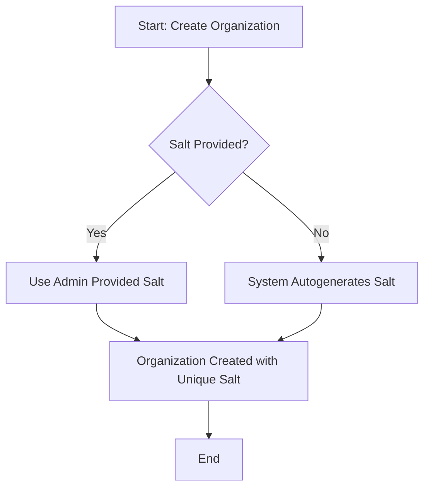
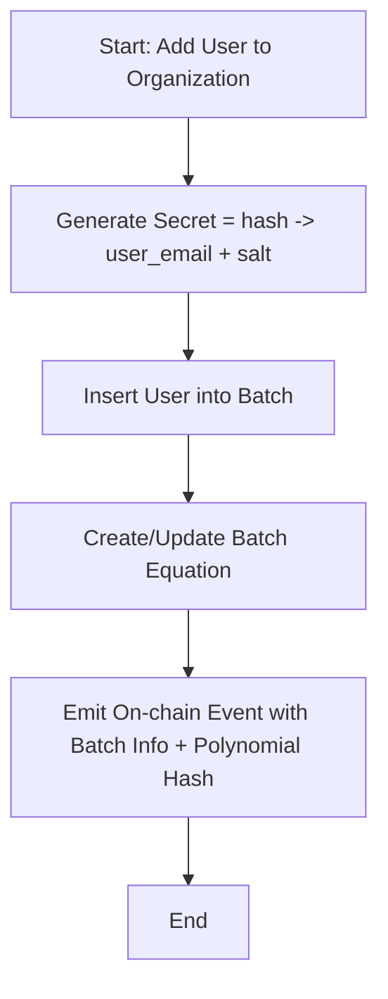
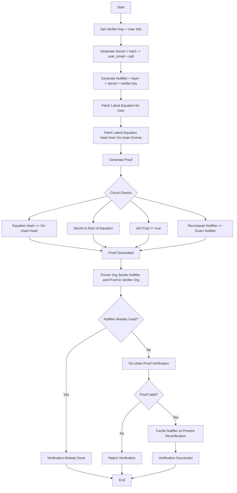

# B2B Membership Zero-Knowledge Proof System

A privacy-preserving membership verification system for B2B organizations using zero-knowledge proofs. This project enables organizations to verify business relationships without revealing sensitive membership information.

## 🔒 Privacy-First Architecture

This system uses polynomial-based zero-knowledge proofs to verify organizational membership while maintaining complete privacy of member identities and organizational structures.

### Key Features

-   **Zero-Knowledge Membership Verification**: Prove membership without revealing identity
-   **KYC Integration**: Enforce compliance requirements through cryptographic proofs
-   **Verification Caching**: Nullifiers enable efficient re-verification by caching previous results
-   **Polynomial-Based Security**: Mathematically sound membership verification using polynomial roots
-   **Scalable Batching**: Support unlimited members through independent polynomial batches
-   **On-Chain Verification**: Decentralized proof verification with smart contract integration

## 🏗️ Technical Architecture

### Core Components

1. **Polynomial Generation**: Organizations generate polynomials where member secrets are roots
2. **Batch Management**: Members are organized into batches of up to 2047 users per polynomial
3. **Hash Commitment**: Polynomial hashes are published on-chain for integrity verification
4. **ZK Circuit**: Noir-based circuit for generating membership proofs
5. **Nullifier System**: Enables efficient verification caching to avoid redundant proof checks
6. **KYC Integration**: Cryptographic enforcement of compliance requirements

### Cryptographic Primitives

-   **Hash Function**: Poseidon2 for efficient zk-SNARK operations
-   **Polynomial Evaluation**: Efficient computation up to degree 2047 per batch
-   **Batch Scaling**: Independent polynomial equations for unlimited membership growth
-   **Nullifier Generation**: Deterministic verification cache identifiers
-   **Commitment Scheme**: Hash-based polynomial commitments

## 🚀 Scalability Architecture

### Batch-Based Scaling

The system overcomes the 128-user polynomial degree limit through intelligent batching:

-   **Batch Size**: Each batch supports up to 128 members
-   **Independent Polynomials**: Each batch has its own polynomial equation
-   **Unlimited Growth**: Organizations can create multiple batches as needed
-   **Batch Identification**: Users are assigned to specific batches during registration

### Scaling Benefits

-   **Linear Scalability**: Add new batches without affecting existing ones
-   **Proof Efficiency**: Each proof only requires the user's specific batch polynomial
-   **Storage Optimization**: Only relevant batch data needed for verification
-   **Parallel Processing**: Multiple batches can be processed independently

## 📋 System Workflow

### Organization Setup



### Member Registration



**Note**: The batching system automatically handles scalability - when a batch reaches 128 members, new users are placed into a new batch with its own independent polynomial equation. This allows organizations to support unlimited members while maintaining efficient proof generation.

### Proof Generation & Verification



## 🛠️ Installation & Setup

### Prerequisites

-   [Noir](https://noir-lang.org/) (latest version)
-   [Node.js](https://nodejs.org/) 18+
-   Git

### Installation

1. **Clone the repository**

    ```bash
    git clone <repository-url>
    cd zkp/b2b_membership
    ```

2. **Install Noir dependencies**

    ```bash
    cd circuit
    nargo check
    ```

3. **Compile the circuit**
    ```bash
    nargo compile
    ```

## 🚀 Usage

### Generating a Proof

1. **Prepare input data** in `Prover.toml`:

    ```toml
    polynomial_hash = "0x..."
    nullifier = "0x..."
    verifier_key = "0x..."
    secret = "0x..."
    isKYCed = true
    polynomial = ["0x...", "0x...", ...]
    ```

2. **Generate the proof**:

    ```bash
    nargo prove
    ```

3. **Verify the proof**:
    ```bash
    nargo verify
    ```

## 🔧 Circuit Parameters

| Parameter         | Type           | Description                                     |
| ----------------- | -------------- | ----------------------------------------------- |
| `polynomial_hash` | `pub Field`    | On-chain polynomial commitment for user's batch |
| `nullifier`       | `pub Field`    | Verification cache identifier                   |
| `verifier_key`    | `pub Field`    | Verification context                            |
| `secret`          | `Field`        | Private member identifier                       |
| `isKYCed`         | `bool`         | KYC compliance status                           |
| `polynomial`      | `[Field; 129]` | Batch-specific membership polynomial            |

### Security Constraints

-   **Polynomial Degree**: Maximum 128 coefficients per batch
-   **Batch Scaling**: Unlimited total members across multiple batches
-   **Hash Security**: Poseidon2 with 254-bit field elements
-   **Nullifier Uniqueness**: Deterministic per (secret, verifier_key) pair for verification caching
-   **KYC Enforcement**: Cryptographic compliance verification

## 🔐 Security Considerations

### Privacy Guarantees

-   **Zero-Knowledge**: No membership information is revealed
-   **Unlinkability**: Proofs cannot be linked to specific users
-   **Forward Secrecy**: Past proofs remain valid after member removal

### Attack Resistance

-   **Verification Caching**: Nullifiers prevent redundant verification overhead
-   **Polynomial Integrity**: Hash commitments ensure data authenticity
-   **KYC Bypass Prevention**: Cryptographic enforcement of compliance

### Audit Recommendations

1. Polynomial generation randomness quality
2. On-chain hash commitment verification
3. Nullifier storage and verification cache management
4. KYC integration security

## 🤝 Contributing

1. Fork the repository
2. Create a feature branch (`git checkout -b feature/amazing-feature`)
3. Commit your changes (`git commit -m 'Add amazing feature'`)
4. Push to the branch (`git push origin feature/amazing-feature`)
5. Open a Pull Request

### Development Guidelines

-   Follow Noir coding standards
-   Add comprehensive tests for new features
-   Ensure circuit constraints are mathematically sound
-   Document security assumptions

## 📄 License

MIT

## 📞 Support

For technical support or questions:

-   Open an issue in the repository
-   Contact the development team
-   Review the [documentation](../../README.md)

---

**Built with ❤️ for privacy-preserving B2B verification**
