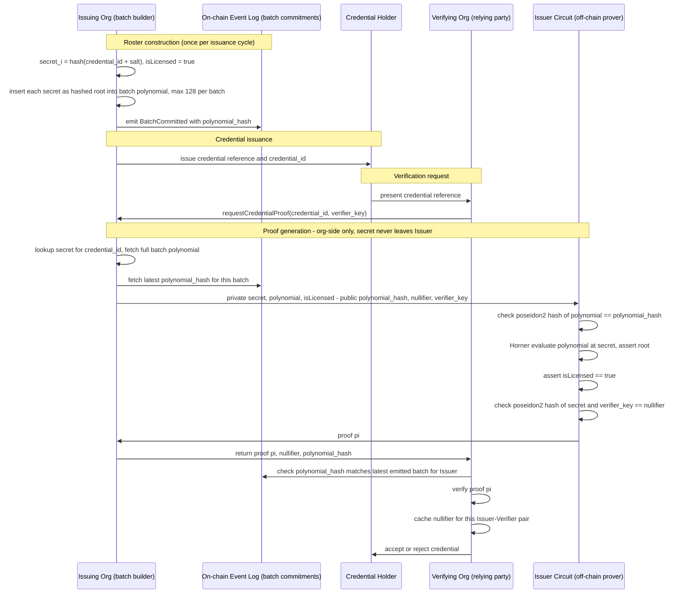

### Credential Verification Flow

The sequence diagram illustrates the end-to-end lifecycle of credential issuance and privacy-preserving verification, where credential membership and validity are proven through a zero-knowledge proof without revealing the underlying credential secret.

#### 1. Roster Construction and Batch Commitment

At the beginning of an issuance cycle, the issuing organization constructs a credential roster.

For each credential, the issuer derives a unique secret value:

```

secret_i = Hash(credential_id || salt)

```

where `credential_id` uniquely identifies the credential and `salt` is issuer-generated randomness.

Each credential secret is inserted as a root into a batch polynomial. A single batch can contain up to 128 credentials. Once the polynomial has been constructed, the issuer computes its commitment (`polynomial_hash`) and publishes this commitment to the on-chain event log through a `BatchCommitted` event.

The event log therefore serves as an immutable public record of the currently active credential batches without exposing any credential-specific information.

#### 2. Credential Issuance

After the batch commitment has been recorded, the issuer provides the credential holder with the issued credential and its corresponding `credential_id`.

The holder does not receive the batch polynomial or the secret used in the proof construction. These values remain exclusively under issuer control.

#### 3. Verification Request

When a holder wishes to prove possession of a valid credential to a verifying organization, the holder presents a credential reference.

The verifier then requests a proof from the issuer by supplying:

- the credential identifier (`credential_id`)
- a verifier-specific key (`verifier_key`)

The verifier-specific key scopes the resulting nullifier to this particular issuer-verifier relationship: the same credential produces a different nullifier for every distinct verifier, which prevents different verifiers from correlating that the same credential was used with each of them. Separately, within a single verifier's domain, the nullifier allows that verifier to detect and reject a duplicate submission of the same proof.

#### 4. Proof Generation

Upon receiving the request, the issuer retrieves:

- the secret corresponding to the credential,
- the batch polynomial containing that credential,
- the latest committed polynomial hash for that batch from the event log.`

The issuer then executes the proving circuit with:

**Private Inputs**

- `secret`
- `polynomial`
- `isLicensed`

**Public Inputs**

- `polynomial_hash`
- `nullifier`
- `verifier_key`

Within the circuit, the following constraints are enforced:

1. The polynomial commitment is validated by recomputing the polynomial hash and checking:

```

Poseidon2(polynomial) = polynomial_hash

```

2. Membership in the committed roster is verified by evaluating the polynomial at the credential secret using Horner's method and asserting that the result is zero:

```

P(secret) = 0

```

3. Credential validity is enforced by asserting:

```

isLicensed = true

```

4. An unlinkable verifier-specific nullifier is generated and validated:

```

Poseidon2(secret, verifier_key) = nullifier

```

If all constraints are satisfied, the circuit produces a zero-knowledge proof `π`.

The issuer returns:

- proof `π`
- `nullifier`
- `polynomial_hash`

to the verifier.

#### 5. Verification

Before accepting the proof, the verifier retrieves the latest batch commitment from the on-chain event log and confirms that the supplied `polynomial_hash` matches the currently committed batch for the issuer.

The verifier then validates the zero-knowledge proof `π`.

Successful verification guarantees that:

- the credential belongs to the committed batch,
- the batch corresponds to the issuer's published commitment,
- the credential is currently marked as licensed,
- the issuer generated the proof using a valid batch member,
- no credential secret or batch polynomial has been disclosed to the verifier (the credential identifier itself is known to the verifier, as it was required to route the request).

The verifier subsequently stores the received nullifier for the specific issuer-verifier relationship. Because the nullifier is derived from both the credential secret and the verifier-specific key, the same credential generates different nullifiers for different verifiers, preventing cross-verifier correlation while still enabling duplicate detection within a single verifier domain.

---

#### Privacy and Security Properties

This protocol provides the following guarantees:

- **Credential Privacy:** The credential secret and the batch polynomial never leave the issuer and are never disclosed to the verifier.
- **Batch Membership Assurance:** Verification proves that the specified credential is genuinely a member of the issuer-committed batch, and that the issuer (who holds the full polynomial) generated the proof honestly — without disclosing the underlying secret or the polynomial coefficients to the verifier. Note: the `credential_id` itself is necessarily known to the verifier, since the holder must supply it to route the verification request; this protocol does not hide *which* credential is being checked, only the secret value underlying it.
- **Verifier-Specific Unlinkability:** Different verifiers observe different nullifiers for the same credential, preventing cross-organizational tracking.
- **Public Auditability:** The on-chain event log provides an immutable reference for validating issuer commitments and preventing proof generation against uncommitted credential sets.
